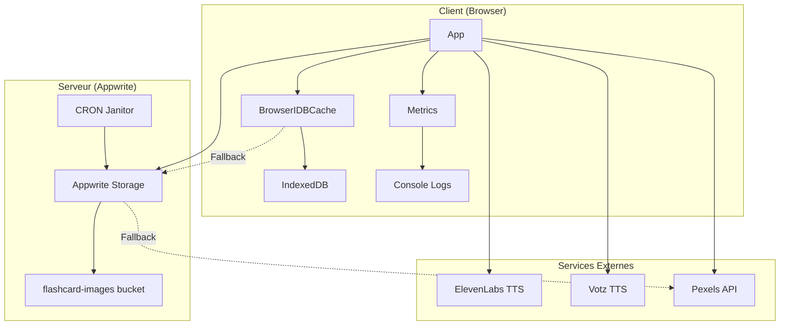

# Cache Ankilang v4 - Documentation Complète

## 🎯 Vue d'ensemble

Le système de cache Ankilang v4 est une solution robuste et observable pour la gestion des médias (audio TTS et images Pexels) avec :

- **Cache distribué** : IndexedDB (client) + Appwrite Storage (serveur)
- **Migration automatique** : Transition transparente depuis localStorage
- **Monitoring intégré** : Métriques de performance et taux de hit
- **Maintenance automatique** : CRON de nettoyage des fichiers expirés
- **Robustesse** : Fallbacks complets en cas d'erreur
- **Configuration flexible** : Feature flags pour déploiement progressif

## 🏗️ Architecture



## ⚙️ Configuration

### Variables d'environnement

```bash
# Activation globale du cache client
VITE_CACHE_ENABLE=true

# Synchronisation serveur (écriture best-effort vers Appwrite Storage)
VITE_CACHE_SERVER_SYNC=false

# Métriques et monitoring (logs de performance)
VITE_CACHE_METRICS=true

# Version du Service Worker (force la mise à jour)
VITE_SW_CACHE_VERSION=v4

# TTL (Time To Live) pour les fichiers TTS en jours
VITE_CACHE_TTS_TTL_DAYS=7

# TTL pour les images Pexels en jours
VITE_CACHE_PEXELS_TTL_DAYS=180
```

### Feature Flags

```typescript
import { FLAGS } from '@/config/flags'

// Vérifier si le cache est activé
if (FLAGS.CACHE_ENABLE) {
  // Logique de cache
}

// Utiliser les TTL configurés
const ttlMs = FLAGS.TTS_TTL_DAYS * 24 * 60 * 60 * 1000
```

## 🔄 Migration Legacy

### Processus automatique

La migration des anciens caches localStorage vers IndexedDB se fait automatiquement au démarrage :

```typescript
// Dans main.tsx
import { migrateLegacyCache } from '@/services/cache/migrate-legacy'

// Migration automatique
const { moved, errors } = await migrateLegacyCache()
console.log(`Migration: ${moved} fichiers migrés, ${errors} erreurs`)
```

### Types de migration

- **TTS localStorage** → **IndexedDB** : Conversion des data URLs en Blobs
- **Clés déterministes** : Reconstruction des clés de cache
- **TTL respecté** : Application des nouveaux TTL configurés

## 📊 Monitoring et Métriques

### Métriques disponibles

```typescript
import { metric, time, getMetricsStats } from '@/services/cache/metrics'

// Mesurer le temps d'exécution
const result = await time('TTS.generate', async () => {
  return await generateTTS(params)
})

// Enregistrer une métrique
metric('TTS.cache', { 
  hit: true, 
  lang: 'fr', 
  textLength: 50 
})

// Obtenir les statistiques
const stats = getMetricsStats()
console.log(`Taux d'erreur: ${stats.errorRate}%`)
```

### Types de métriques

| Type | Description | Exemple |
|------|-------------|---------|
| `TTS.cache` | Hit/miss du cache TTS | `{ hit: true, lang: 'fr' }` |
| `TTS.generate` | Temps de génération TTS | `{ ms: 184, success: true }` |
| `Pexels.cache` | Hit/miss du cache Pexels | `{ hit: false, pexelsId: '123' }` |
| `Cache.clear` | Nettoyage du cache | `{ success: true, clearedCount: 5 }` |

## 🧹 Maintenance Automatique

### Fonction CRON Janitor

```javascript
// apps/functions/cache-janitor/index.js
export default async ({ res, log }) => {
  // Configuration
  const TTS_TTL_DAYS = 90
  const PEXELS_TTL_DAYS = 180
  
  // Nettoyage des fichiers expirés
  const result = await cleanExpiredFiles()
  
  return res.json({
    scanned: result.scanned,
    deleted: result.deleted,
    errors: result.errors
  })
}
```

### Planification CRON

```bash
# Exécution quotidienne à 2h du matin
0 2 * * * curl -X POST https://your-appwrite-function.com/cache-janitor
```

### Types de fichiers nettoyés

- **TTS** : `tts-*`, `cache_tts_*` (TTL: 90 jours)
- **Pexels** : `pexels-*`, `cache_pexels_*` (TTL: 180 jours)

## 🛡️ Robustesse et Fallbacks

### Stratégies de fallback

1. **Cache IDB indisponible** → Génération directe
2. **Appwrite Storage erreur** → URL Pexels directe
3. **Téléchargement Pexels échec** → Retry avec backoff
4. **Quota IndexedDB dépassé** → Nettoyage automatique

### Gestion d'erreurs

```typescript
// Exemple de fallback robuste
try {
  const cached = await idb.get<Blob>(key)
  if (cached) return cached
} catch (error) {
  console.warn('[TTS] Cache IDB indisponible:', error)
  metric('TTS.cache.error', { error: error.message })
}

// Fallback vers génération directe
return await generateTTSFromAPI()
```

## 🔧 Service Worker v4

### Configuration

```typescript
// vite.config.ts
VitePWA({
  workbox: {
    cacheId: `ankilang-${process.env.VITE_SW_CACHE_VERSION ?? 'v4'}`,
    navigateFallbackDenylist: [
      /^\/api\//,
      /^\/sqljs\/.*$/,
      /^\/assets\/.*\.wasm$/,
      /^\/manifest\.webmanifest(\?.*)?$/,
    ],
    runtimeCaching: [
      {
        urlPattern: ({url}) => url.pathname.startsWith('/v1/storage/buckets/'),
        handler: 'CacheFirst',
        options: {
          cacheName: 'appwrite-media',
          expiration: { maxEntries: 500, maxAgeSeconds: 60 * 60 * 24 * 90 }
        }
      }
    ]
  }
})
```

### Protection des assets critiques

- **Fichiers WASM** : Non interceptés par le SW
- **Manifest** : Accès direct garanti
- **API routes** : Pas de fallback HTML
- **SQL.js** : Protection complète

## 🎛️ Interface Utilisateur

### Bouton de gestion du cache

```typescript
// Composant avec métriques
<CacheClearButton className="mt-4" />
```

### Informations affichées

- **Stockage utilisé** : Taille actuelle / quota
- **Nombre d'entrées** : Estimation du nombre de fichiers
- **Métriques de performance** : Temps moyen, taux d'erreur
- **Confirmation intelligente** : Avec taille du cache

## 🚀 Déploiement

### Checklist de déploiement

#### Phase 1 - Préparation
- [ ] Variables d'environnement configurées
- [ ] Feature flags validés
- [ ] Tests de migration effectués

#### Phase 2 - Déploiement
- [ ] Build sans erreurs TypeScript
- [ ] Service Worker v4 actif
- [ ] Migration legacy fonctionnelle

#### Phase 3 - Validation
- [ ] Cache TTS opérationnel
- [ ] Cache Pexels opérationnel
- [ ] Métriques visibles dans la console
- [ ] CRON janitor configuré

### Commandes utiles

```bash
# Build et vérification
pnpm -w --filter apps/web build
pnpm -w --filter apps/web typecheck

# Test de la fonction CRON
cd apps/functions/cache-janitor
node test.mjs

# Vérification du Service Worker
# DevTools > Application > Service Workers
```

## 🔍 Debugging

### Logs de cache

```bash
# Console du navigateur
[METRIC] TTS.cache { hit: true, lang: 'fr', textLength: 50 }
[METRIC] TTS.generate { ms: 184, success: true }
[Cache][browser-idb] HIT: tts:fr:Rachel:0.8:abc123...
[Cache][migrate] moved=5
```

### Vérification du stockage

```javascript
// Console du navigateur
// Vérifier IndexedDB
localforage.keys().then(keys => console.log('Cache keys:', keys))

// Vérifier le quota
navigator.storage.estimate().then(estimate => 
  console.log('Storage:', estimate.usage, '/', estimate.quota)
)
```

### Métriques en temps réel

```javascript
// Console du navigateur
import { getMetricsStats, exportMetrics } from '@/services/cache/metrics'

// Statistiques actuelles
console.log(getMetricsStats())

// Export complet
console.log(exportMetrics())
```

## 📈 Performance

### Optimisations implémentées

- **Clés déterministes** : Hash SHA-256 pour éviter les collisions
- **TTL intelligent** : Expiration automatique des fichiers
- **Compression** : Blobs optimisés pour le stockage
- **Batch processing** : Traitement par lots pour le CRON
- **Lazy loading** : Chargement à la demande

### Métriques de performance attendues

| Métrique | Valeur cible | Description |
|----------|--------------|-------------|
| TTS Cache Hit Rate | >80% | Taux de succès du cache TTS |
| Pexels Cache Hit Rate | >90% | Taux de succès du cache Pexels |
| TTS Generation Time | <500ms | Temps de génération TTS |
| Cache Clear Time | <2s | Temps de nettoyage du cache |
| Storage Usage | <100MB | Utilisation du stockage local |

## 🛠️ Maintenance

### Tâches régulières

1. **Surveillance des métriques** : Vérifier les taux d'erreur
2. **Nettoyage manuel** : Si nécessaire, vider le cache
3. **Mise à jour des TTL** : Ajuster selon l'usage
4. **Monitoring du CRON** : Vérifier l'exécution quotidienne

### Dépannage

#### Cache ne fonctionne pas
1. Vérifier `VITE_CACHE_ENABLE=true`
2. Contrôler les logs de migration
3. Tester IndexedDB dans DevTools

#### Métriques manquantes
1. Vérifier `VITE_CACHE_METRICS=true`
2. Contrôler la console pour les logs `[METRIC]`
3. Tester `getMetricsStats()`

#### CRON ne s'exécute pas
1. Vérifier la configuration Appwrite
2. Tester l'exécution manuelle
3. Contrôler les logs de la fonction

## 🔮 Évolutions futures

### v5 - Observabilité avancée
- Dashboard de métriques en temps réel
- Alertes automatiques
- Export des métriques vers un service externe

### v6 - Cache distribué
- Synchronisation multi-appareils
- Cache partagé entre utilisateurs
- Optimisations réseau avancées

---

## 📞 Support

Pour toute question ou problème :

1. **Logs** : Vérifier la console du navigateur
2. **Métriques** : Utiliser `getMetricsStats()`
3. **Debug** : Activer `VITE_CACHE_METRICS=true`
4. **Documentation** : Consulter ce fichier

**Version** : v4.0.0  
**Dernière mise à jour** : $(date)  
**Auteur** : Équipe Ankilang
